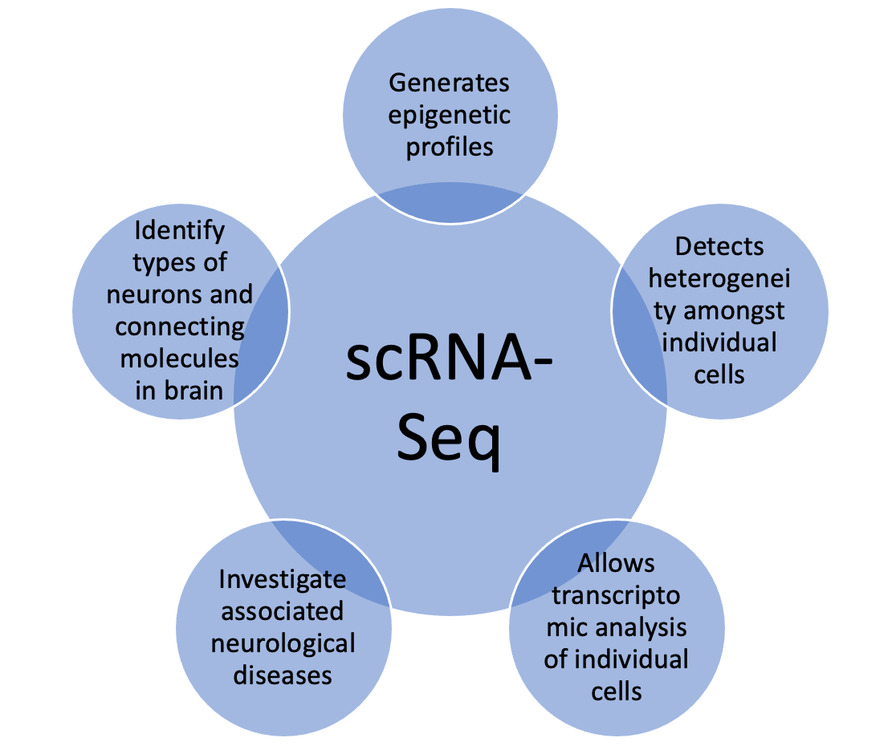
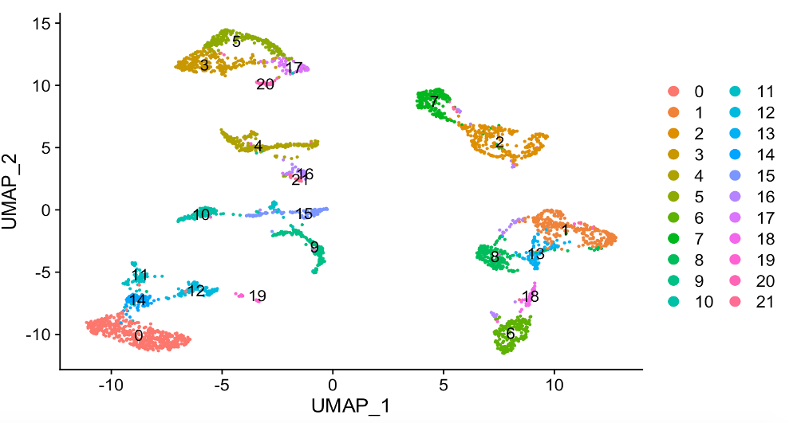
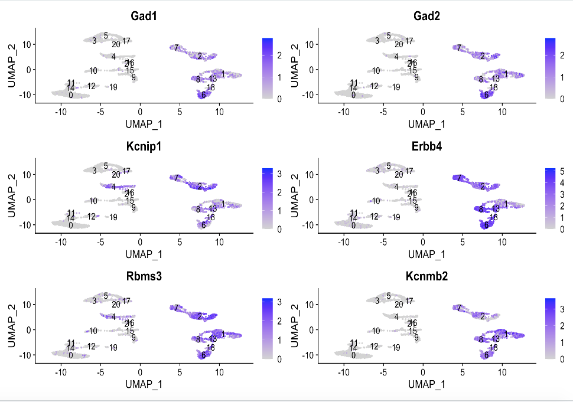
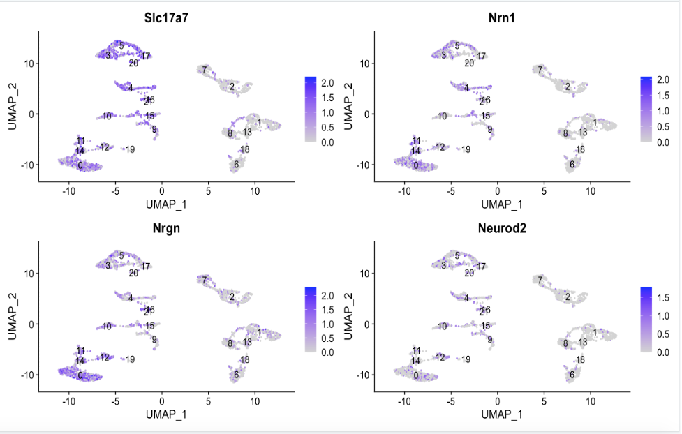
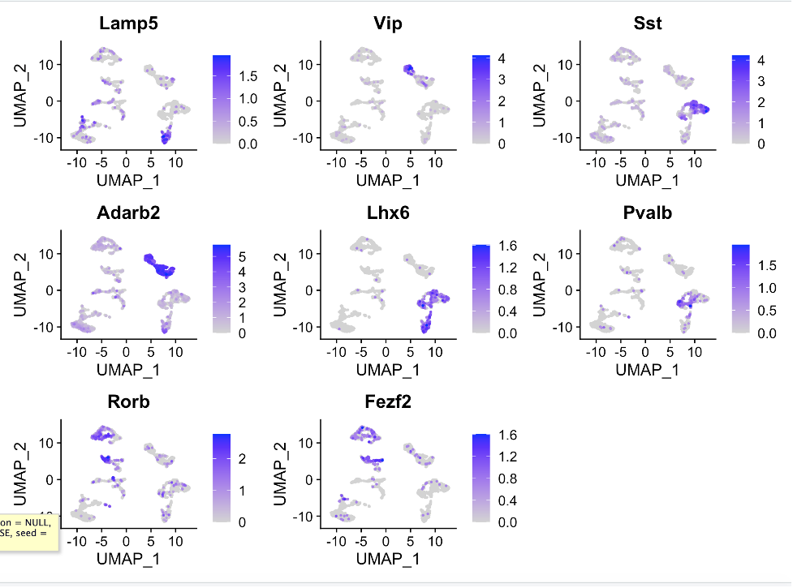
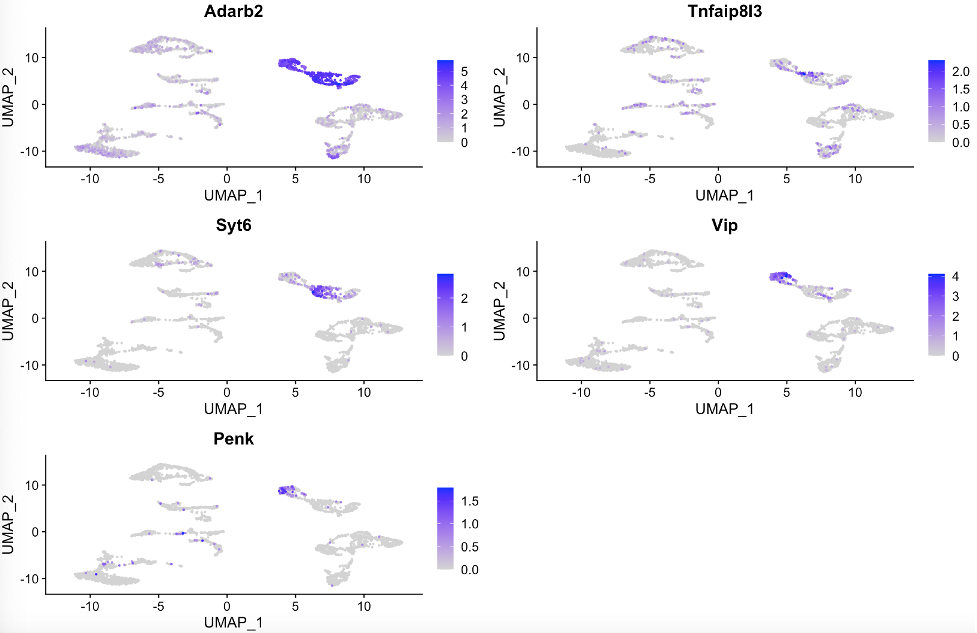

# About the Project

-	Although we know that Hippocampus is involved in memory 
storage, we are still unclear of how it does so. 
-	The heterogeneity among neurons makes it difficult
to study how brain circuits are formed and to
resolve neuronal connections
-	Sample: Single cell sequencing reads of mouse 
Hippocampus region from 10x platform
-	Language: R– packages Seurat, gdata, Matrix,
tidyverse, dplyr

Dimension Reduction by UMAP and clustering of the scRNA-seq data generated 22 clusters of cells.

On plotting marker genes, two broad classes of neurons were established.
Inhibitory neurons:

Excitatory Neurons:

Gene markers helped to identify clusters and sub-clusters of cells. Each gene marker marked a specific part of cluster.

Finding type of cell for each cluster, we focused on each cluster individually to find subparts. For example, in the figure below, Adarb2 gene marks the mother cluster and Tnfaip8l3, Syt6, Vip, Penk mark specific regions in the mother cluster.
